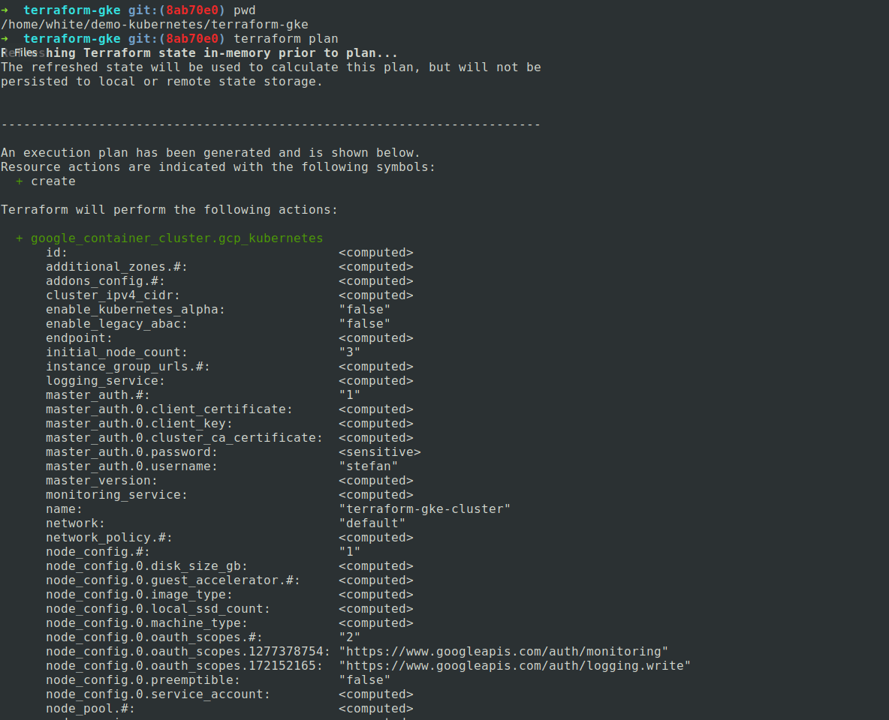
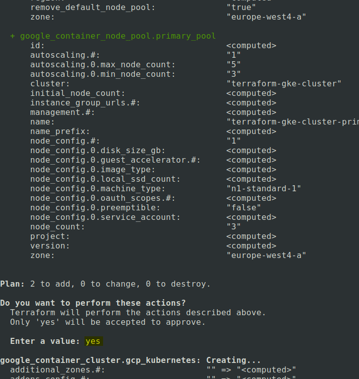
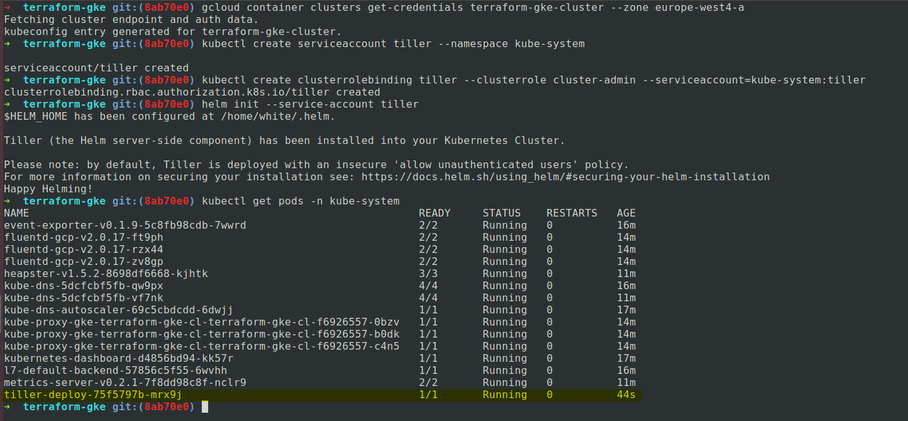

# Kubernetes demo

Small demo application deployed within GKE(Google Kubernetes Engine) with Terraform and Helm.

# About the projects used in this demo project:

## Terraform-gke

Contains all the code necesessary for setting up a Kubernetes Cluster with Terraform, by default it uses a Google bucket to save the state of the infrastructure, it is possible to also use a Consul backend(look at the code for the example) or local statefile which is only indicated for local/dev projects.

## Flask-app

Contains a small dummy webserver in Flask(Python webframework) and a Dockerfile, both of which are used for building a small custom Docker image with the help of a Travis-CI pipeline which pushes the image to Dockerhub. (see .travis.yml for implementation)

## Helm-app-gke

Contains the helm charts used for deploying the Flask-app and prometheus to the kubernetes cluster which gets created by Terraform.(make sure you've also initialized Tiller in the Kubernetes cluster.)


# Prerequisites:

* preferably a Linux distro(Ubuntu has been used for the deploy of this app)
* Google Cloud account (https://console.cloud.google.com/)
* Terraform installed (https://www.terraform.io/downloads.html)
* Google cloud SDK, gcloud (https://cloud.google.com/sdk/)
* kubectl installed (https://kubernetes.io/docs/tasks/tools/install-kubectl/)
* helm installed (https://github.com/kubernetes/helm/blob/master/docs/install.md)
* Consul installed, if you prefer having the Terraform state saved in it, rather than in a Google bucket.

# How to set up the Google Cloud account

# How to set up of the repository

```
# Clone the repository
git clone https://github.com/stefan-caraiman/demo-kubernetes
# Change working directory
cd demo-kubernetes
# Fetch the submodules code
git submodule update --init --recursive
```

# How to set up the Kubernetes cluster with Terraform

1. Setup all the required variables and account details in the terraform-gke repository as shown below:


2. Check the terraform plan



3. If all seems to be in check, run the apply command ```terraform apply```



4. Install the Helm server(Tiller) inside the Kubernetes cluster.



# Useful resources found during the implentation of this demo:

* https://www.youtube.com/watch?v=9Wzw84Q-8yc
* https://itnext.io/kubernetes-monitoring-with-prometheus-in-15-minutes-8e54d1de2e13
* https://dzone.com/articles/build-a-kubernetes-cluster-on-gcp-with-terraform
* https://github.com/hashicorp/terraform-guides/tree/master/infrastructure-as-code/k8s-cluster-gke
* https://nickcharlton.net/posts/kubernetes-terraform-google-cloud.html
* https://akomljen.com/get-kubernetes-cluster-metrics-with-prometheus-in-5-minutes/