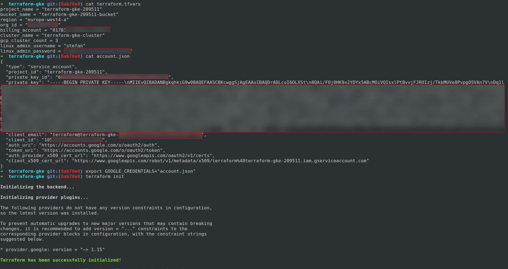

# Kubernetes demo

Small demo application deployed within GKE(Google Kubernetes Engine) with Terraform and Helm.

# Prerequisites:

* preferably a Linux distro(Ubuntu has been used for the deploy of this app)
* Google Cloud account (https://console.cloud.google.com/)
* Terraform installed (https://www.terraform.io/downloads.html)
* Google cloud SDK, gcloud (https://cloud.google.com/sdk/)
* kubectl installed (https://kubernetes.io/docs/tasks/tools/install-kubectl/)
* helm installed (https://github.com/kubernetes/helm/blob/master/docs/install.md)
* Consul installed, if you prefer having the Terraform state saved in it, rather than in a Google bucket.

# Creatin the Kubernetes cluster

1. Setup all the required variables and account details in the terraform-gke repository as shown below:

# Useful resources found during the implentation of this demo:

* https://www.youtube.com/watch?v=9Wzw84Q-8yc
* https://itnext.io/kubernetes-monitoring-with-prometheus-in-15-minutes-8e54d1de2e13
* https://dzone.com/articles/build-a-kubernetes-cluster-on-gcp-with-terraform
* https://github.com/hashicorp/terraform-guides/tree/master/infrastructure-as-code/k8s-cluster-gke
* https://nickcharlton.net/posts/kubernetes-terraform-google-cloud.html
* https://akomljen.com/get-kubernetes-cluster-metrics-with-prometheus-in-5-minutes/