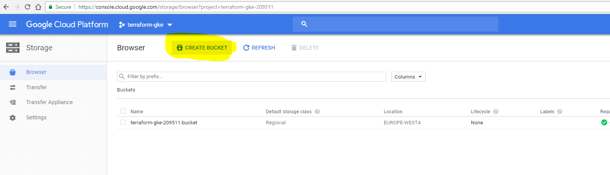
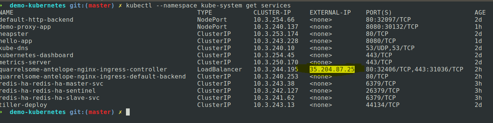
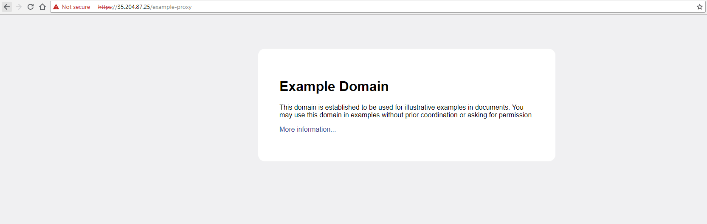

# Kubernetes demo

Small demo application deployed within GKE(Google Kubernetes Engine) with Terraform and Helm.

# About the projects used in this demo project:

## Terraform-gke

Contains all the code necesessary for setting up a Kubernetes Cluster with Terraform, by default it uses a Google bucket to save the state of the infrastructure, it is possible to also use a Consul backend(look at the code for the example) or local statefile which is only indicated for local/dev projects.

## Demo-proxy

Contains a webserver in Gunicorn(Python webframework) and a Dockerfile, both of which are used for building a small custom Docker image with the help of a Travis-CI pipeline which pushes the image to Dockerhub. (see .travis.yml for implementation)

## Helm-app-gke

Contains the helm charts used for deploying the Python webserver worker and server to the kubernetes cluster which gets created by Terraform.(make sure you've also initialized Tiller in the Kubernetes cluster.)

# Prerequisites:

* preferably a Linux distro(Ubuntu has been used for the deploy of this app)
* Google Cloud account (https://console.cloud.google.com/)
* Terraform installed (https://www.terraform.io/downloads.html)
* Google cloud SDK, gcloud (https://cloud.google.com/sdk/)
* kubectl installed (https://kubernetes.io/docs/tasks/tools/install-kubectl/)
* helm installed (https://github.com/kubernetes/helm/blob/master/docs/install.md)
* Consul installed, if you prefer having the Terraform state saved in it, rather than in a Google bucket.

# How to set up the Google Cloud account:

Register for a Google Cloud account and create a new project, preferably a project with the same name as the one used for this demo(terraform-gke-randomid) so that it is easier to follow along.

# How to setup a Google bucket for saving the Terraform state:



# How to set up the repository

```
# Clone the repository
git clone https://github.com/stefan-caraiman/demo-kubernetes
# Change working directory
cd demo-kubernetes
# Fetch the submodules code
git submodule update --init --recursive
```

# How to set up the Kubernetes cluster with Terraform:

1. Setup all the required variables and account details in the terraform-gke repository as shown below(make sure to also follow the documentation found in the terraform-gke repository for setting the ```account.json``` and ```terraform.tfvars``` files):


2. Check the terraform plan


3. If all seems to be in check, run the apply command ```terraform apply```


4. Install the Helm server(Tiller) inside the Kubernetes cluster(code can also be found in the terraform-gke repository).


# How to set up Helm

This will set up the webserver proxy application and the other required components(an Nginx server and Redis cluster).

```
cd helm-app-gke/
helm install stable/nginx-ingress --namespace kube-system --set controller.hostNetwork=true,controller.kind=DaemonSet
kubectl apply -f ingress-demo-proxy.yaml --namespace kube-system
helm install --namespace kube-system stable/redis-ha --name redis-ha
helm install --namespace kube-system  ./app --name demo-proxy
```

## Get the public external IP and access it.





# Useful resources found during the implentation of this demo:

* https://www.youtube.com/watch?v=vQX5nokoqrQ
* https://www.youtube.com/watch?v=0VEeuM-CUWQ
* https://dzone.com/articles/build-a-kubernetes-cluster-on-gcp-with-terraform
* https://github.com/hashicorp/terraform-guides/tree/master/infrastructure-as-code/k8s-cluster-gke
* https://nickcharlton.net/posts/kubernetes-terraform-google-cloud.html
* https://akomljen.com/get-kubernetes-cluster-metrics-with-prometheus-in-5-minutes/